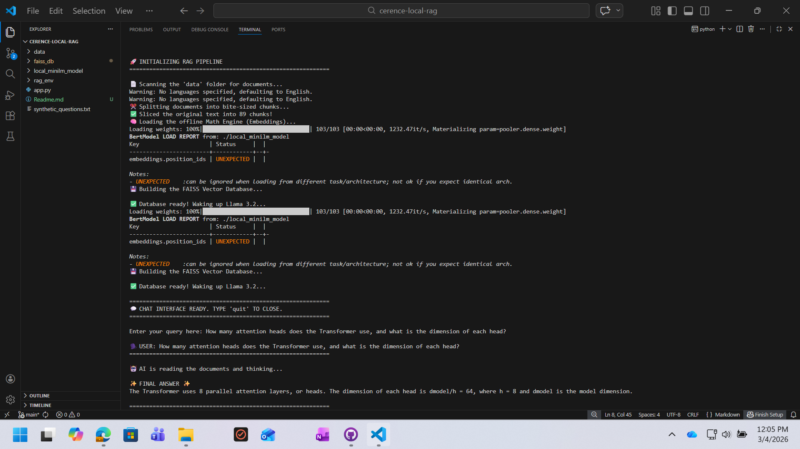

# Secure Enterprise Local RAG Pipeline 

An end-to-end, 100% offline Retrieval-Augmented Generation (RAG) pipeline designed to run on local hardware. This project allows users to perform semantic search and conversational Q&A over internal, restricted PDF documents (like Confluence exports) without sending sensitive data to external cloud APIs like OpenAI.

## See it in Action



## 🌟 Features
* **100% Air-Gapped:** Bypasses corporate firewalls and SSL interception by running entirely offline. 
* **Data Privacy:** No document data or user queries ever leave the local machine.
* **Local Embeddings:** Utilizes `all-MiniLM-L6-v2` running on local CPU for blazing-fast vectorization.
* **In-Memory Vector DB:** Uses Facebook's FAISS (Facebook AI Similarity Search) for optimized, dependency-light semantic retrieval.
* **Local LLM Generation:** Powered by Meta's `Llama 3.2` via Ollama for intelligent context synthesis.
* **Modern LangChain Architecture:** Built using pure LCEL (LangChain Expression Language) for maximum speed and compatibility.

## 🛠️ Tech Stack
* **Language:** Python (Tested on 3.12 / 3.14-pre)
* **Framework:** LangChain (`langchain-core`, `langchain-community`, `langchain-ollama`)
* **Vector Database:** FAISS (`faiss-cpu`)
* **Embedding Model:** `sentence-transformers/all-MiniLM-L6-v2`
* **Local LLM Engine:** Ollama (`llama3.2`)
* **Document Parsing:** `unstructured`, `pdfminer`

## 🚀 Setup Instructions

### 1. Install Dependencies in virtual environment
```bash
pip install langchain langchain-core langchain-community langchain-ollama langchain-huggingface faiss-cpu unstructured pdfminer.six sentence-transformers

```

### 2. Install & Start Ollama outside venv

1. Download Ollama from [ollama.com](https://ollama.com/).
2. Pull the Llama 3.2 model:

```bash
ollama run llama3.2

```

### 3. Setup the Offline Embedding Model

To ensure the pipeline works behind strict corporate firewalls (Zscaler/Netskope), the embedding model must be downloaded manually:

1. Create a folder named `local_minilm_model` in the root directory.
2. Download the required files from the [HuggingFace all-MiniLM-L6-v2 repository](https://huggingface.co/sentence-transformers/all-MiniLM-L6-v2/tree/main) into this folder.
3. Inside `local_minilm_model`, create a sub-folder named `1_Pooling` containing a `config.json` file with the pooling parameters.

### 4. Run the Pipeline

Place your target PDFs inside the `./data` folder and run:

```bash
python app.py

```

Type your questions at the `🗣️ USER:` prompt. Type `quit` to exit.

---

## 🛑 Engineering Challenges & Resolutions (Post-Mortem)

Building an AI pipeline in a locked-down enterprise environment presented several architectural challenges. Below is the documentation of errors encountered and the engineering pivots used to resolve them.

### 1. Corporate Firewall SSL Interception

* **Error:** `[SSL: CERTIFICATE_VERIFY_FAILED] certificate verify failed: unable to get local issuer certificate`
* **Root Cause:** The corporate network uses Deep Packet Inspection (DPI). When `huggingface_hub` attempted to download the `MiniLM` embedding model, the strict `httpx` client intercepted the company's internal firewall certificate and terminated the connection for security reasons.
* **Resolution (The Air-Gapped Pivot):** Abandoned automated downloads. Manually downloaded the raw model weights (`.safetensors`) and config files via browser, placed them in a local directory (`./local_minilm_model`), and re-routed `HuggingFaceEmbeddings` to read from the local disk.

### 2. Missing Submodule in Offline Model

* **Error:** `TypeError: Pooling.__init__() missing 1 required positional argument: 'word_embedding_dimension'`
* **Root Cause:** By manually downloading the HuggingFace files, the `1_Pooling` submodule configuration was missing. The Transformer couldn't determine the output dimension size (384).
* **Resolution:** Reverse-engineered the model's expected directory structure. Created the `1_Pooling/config.json` file manually and injected the required `"word_embedding_dimension": 384` configuration.

### 3. Pydantic Dependency (ChromaDB)

* **Error:** `pydantic.v1.errors.ConfigError: unable to infer type for attribute "chroma_server_nofile"`
* **Root Cause:** Version mismatch. Modern Python environments strictly enforce typing, but `ChromaDB` relies on an older `pydantic v1` backbone. The clash caused a fatal configuration error during database initialization.
* **Resolution:** Ripped out ChromaDB entirely. Pivoted the architecture to use **FAISS (Facebook AI Similarity Search)**. FAISS operates entirely in-memory with near-zero external dependencies, completely bypassing the Pydantic typing conflicts.

### 4. PDF Mathematical Flattening

* **Issue:** Highly complex academic PDFs (e.g., "Attention Is All You Need") output mangled text during the chunking phase because standard PDF parsers cannot interpret complex mathematical matrices and superscripts (e.g., $W_i^Q \in \mathbb{R}^{d_{model} \times d_k}$ became `W Q i ∈ Rdmodel×dk`).
* **Resolution:** Relied on the LLM Generation layer. Because LLMs are pre-trained on these academic papers, providing the mangled text as context was sufficient. The LLM acted as a semantic autocorrect, converting the ugly chunks into perfectly formatted English responses.

### 5. Python 3.14 Compatibility & LangChain Legacy Modules

* **Error:** `ModuleNotFoundError: No module named 'langchain.chains'`
* **Root Cause:** The development environment utilized Python 3.14 (pre-release). LangChain's legacy high-level wrappers (`RetrievalQA`, `.chains`) were failing to compile/link correctly in this bleeding-edge environment.
* **Resolution (Pure LCEL):** Dropped the legacy high-level APIs. Rewrote the entire generation pipeline using **LangChain Expression Language (LCEL)** and core primitives (`RunnablePassthrough`, `StrOutputParser`). This resulted in cleaner, faster, and more robust code:
`rag_chain = {"context": retriever | format_docs, "input": RunnablePassthrough()} | QA_PROMPT | llm | StrOutputParser()`

```

```